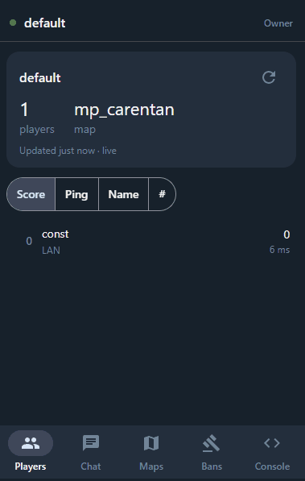
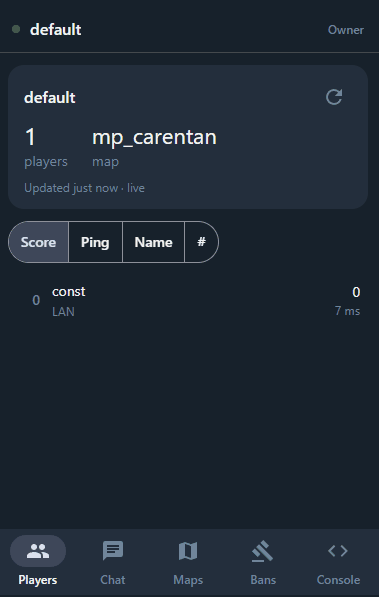

# cod2admin

[](https://github.com/constantant/cod2admin/releases/latest)
[](https://github.com/constantant/cod2admin/actions/workflows/ci.yml)

A Telegram/RCON admin bot for Call of Duty 2 dedicated servers: ban/kick/tempban players,
receive `!report` cards from players in-game, manage other admins, and more.

- **Using the bot on your server?** See [`installer/README.md`](./installer/README.md).
- **Contributing code?** See [`CONTRIBUTING.md`](./CONTRIBUTING.md).
- **Project design/roadmap:** see [`docs/PLAN.md`](./docs/PLAN.md) (condensed Russian summary:
  [`docs/PLAN-ru.md`](./docs/PLAN-ru.md)). Companion plans:
  [`docs/PLAN-russia-access.md`](./docs/PLAN-russia-access.md) (running where Telegram is
  blocked; partly built) and [`docs/PLAN-miniapp.md`](./docs/PLAN-miniapp.md) (a Telegram Mini
  App).

## Mini App

Besides chat commands, admins can open a Telegram Mini App with live players, chat, maps, bans
and an RCON console:

<p>
  
  
</p>

## Attribution

IP country labels (`/players`, report cards, `/bans`) and provider names (`/players`, report
cards) use the [IP to Country Lite](https://db-ip.com/db/download/ip-to-country-lite) and
[IP to ASN Lite](https://db-ip.com/db/download/ip-to-asn-lite) databases — or, with
`GEOIP_CITY_ENABLED=true`, [IP to City Lite](https://db-ip.com/db/download/ip-to-city-lite)
instead of the country one — by
[DB-IP.com](https://db-ip.com), licensed under
[CC BY 4.0](https://creativecommons.org/licenses/by/4.0/). The bot downloads them itself and
refreshes them monthly; they aren't part of this repository or its releases.

VPN flags (`/players`, report cards) use the data-centre and VPN range lists from
[X4BNet/lists_vpn](https://github.com/X4BNet/lists_vpn) and the Tor Project's
[exit list](https://check.torproject.org/torbulkexitlist). The bot downloads them itself and
refreshes them weekly; they aren't part of this repository or its releases either.

## Layout

This is a pnpm/Nx workspace:

- `apps/gateway` — the Telegram bot (grammy), plus the Mini App's backend
- `apps/miniapp-web` — the Telegram Mini App (Angular)
- `packages/rcon-client` — CoD2 RCON protocol client
- `packages/admin-store`, `packages/ban-store` — Postgres-backed admin roles and ban records
  (Drizzle)
- `packages/log-tailer`, `packages/report-pipeline` — live `games_mp.log` tailing and the
  `!report` pipeline
- `packages/telegram-relay` — a small Bot API relay for hosts where Telegram is blocked,
  deployed separately (see its README)
- `installer/` — the standalone installer bundle shipped to CoD2 server admins
  (see `scripts/build-installer-bundle.sh` and `scripts/release.sh`)

## Development

```sh
pnpm install
pnpm exec nx run-many -t lint test build typecheck e2e
```

See [`CONTRIBUTING.md`](./CONTRIBUTING.md) for commit conventions and the PR/CI flow.
